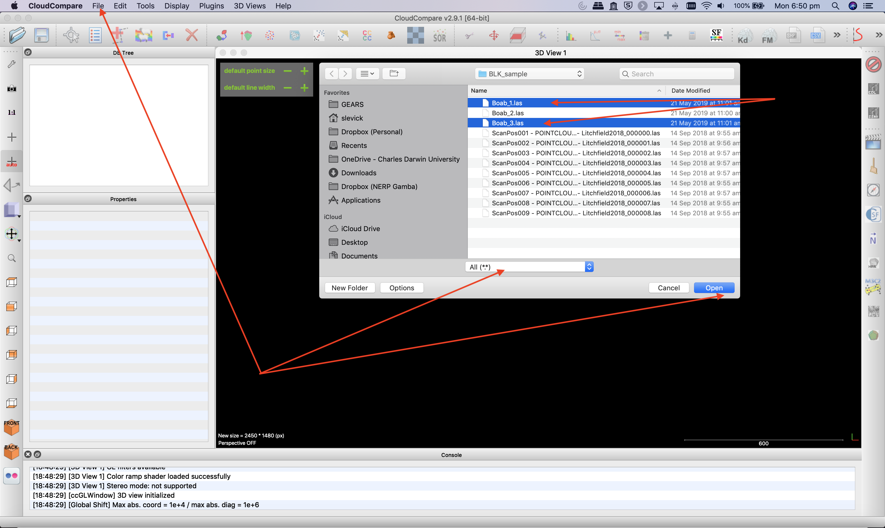
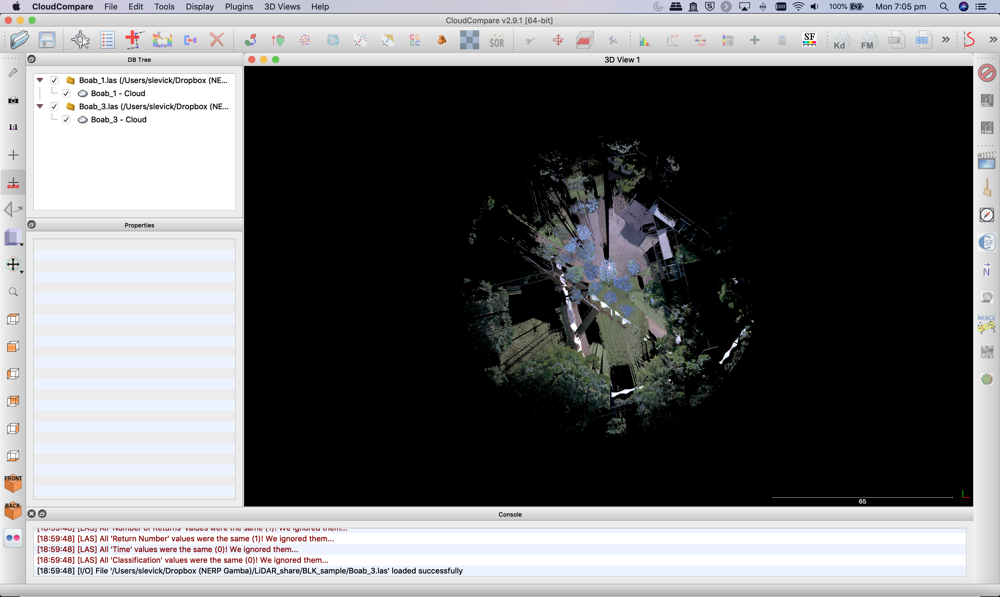
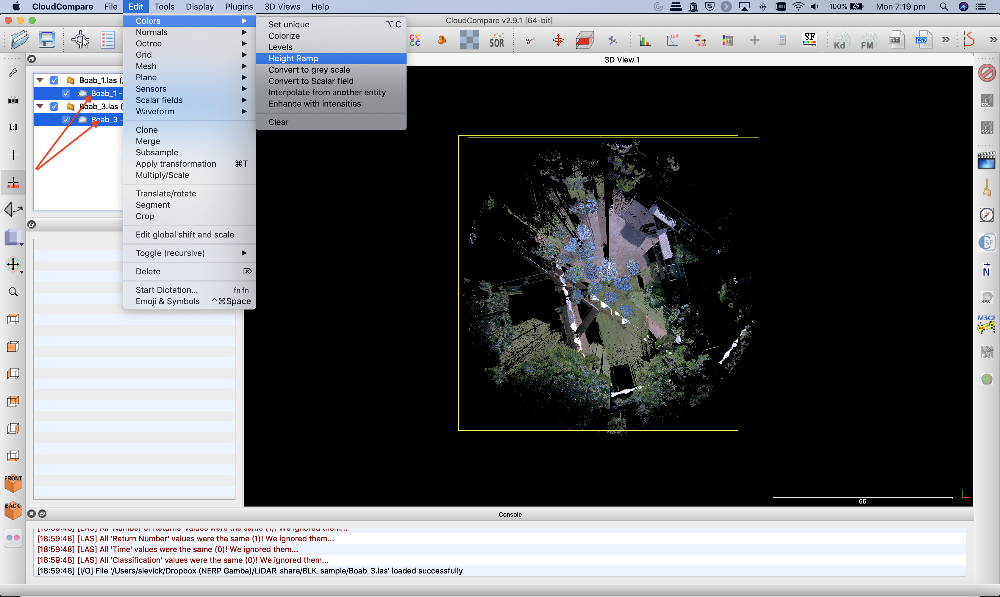
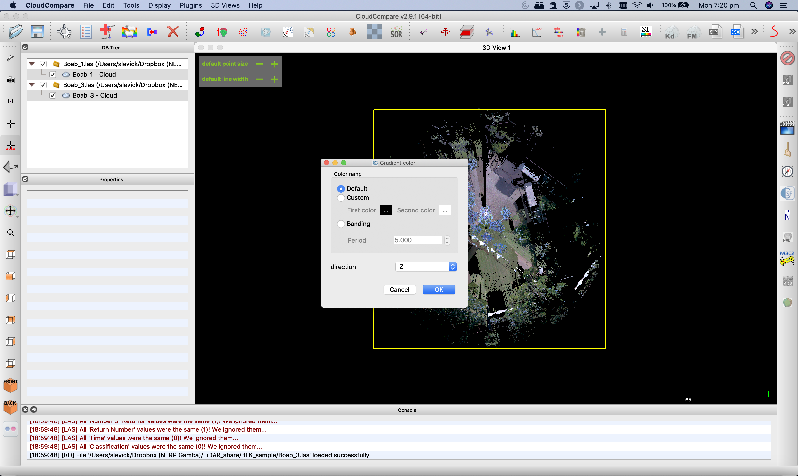
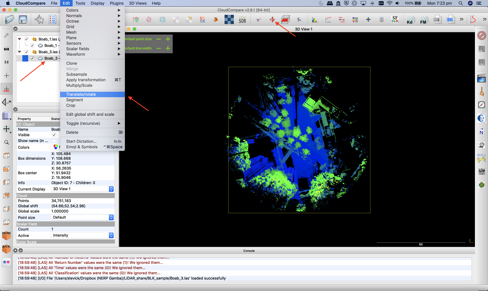
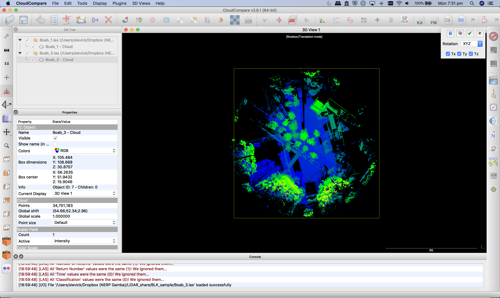
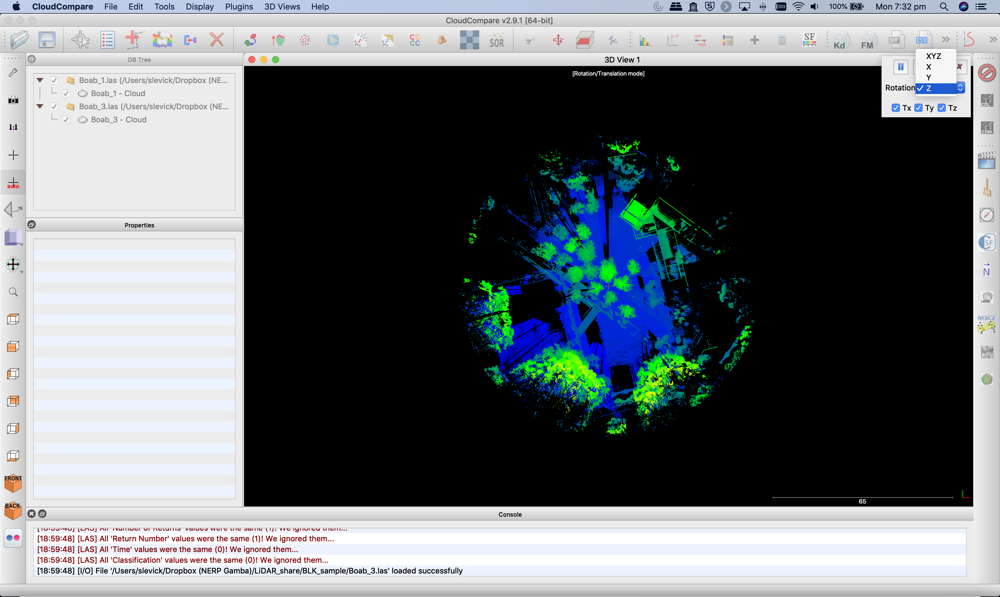

GEARS - Geospatial Engineering and Remote Sensing lab - https://www.gears-lab.com

# Introduction to Remote Sensing of the Environment
Lab 10 - Working with Terrestrial Laser Scanning (TLS) data in CloudCompare continued
--------------

### Prerequisites
-------------

Completion of this lab exercise requires use of the CloudCompare software package. CloudCompare is a powerful package for visualising and processing point-clouds, and best of all is open-access. You can download the version to match your operating system here:

https://www.danielgm.net/cc/

------------------------------------------------------------------------

### Background and objective

The objective of this lab is to familiarise yourself with 3D point cloud data. We will use data that we collected last week on campus in the Boab court. We collected multiple scans with a Leica BLK360 laser scanner, and we will work with some of these scans today.

Scan data can be downloaded in .las format here (please note that each file is ~ 1GB):

[Scan 1](https://www.dropbox.com/s/e172wfagzt50qfm/Boab_1.las?dl=0) | [Scan 2](https://www.dropbox.com/s/faa42pr89rdc7g6/Boab_2.las?dl=0) | [Scan 3](https://www.dropbox.com/s/pta1p7h50gta434/Boab_3.las?dl=0)

----------

## Getting to know CloudCompare

Please see last week's lab here: [Lab 9](https://github.com/geospatialeco/GEARS/blob/master/Intro_RS_Lab9.md)

## Merging multiple point clouds

1. Open up CloudCompare and choose File>Open from the main menu.

2. Navigate to where the scan data are stored and select Boab_1.las and Boab_3.las before clicking "Open". If you cannot see your files or they are greyed out, make sure you have the file type set to ".las" or "All".

3. Click "Apply to all" and "Yes to all" when the two dialogue boxes pop up.

4. Once the two files have loaded, you will see that they are not correctly aligned.

5. In fact, if you zoom in closer (using the mouse wheel), you will see that they are positioned exactly on top of each other (even though they were collected ~ 10m apart).

6. This issues occurs because the scans are in the scanners own coordinated system (SOC) and not in a geographic coordinate system (the BLK360 lacks a GPS). The origin of both scans is 0,0,0 (x,y,z) - every point is relative to the scanner itself.

7. We will align these two scans using a combination of manual translation (rough positioning) and an automated computer algorithm called Iterative Closest Point (ICP) for fine tuning.

8. Before starting with this, let us map both clouds according to an elevation colour scale (height ramp) - using the defaults scale for blue to green. be sure to select both clouds before applying the colour ramp.

9. Next select only the Boab_3.las file, and choose the "Translate" tool from either the main Menu or from the icon in the toolbar.

10. You will see a new toolbar appear in the top-right corner of the main window, and small white text in the top-centre of the main window will remind you that the tool is active.

11. Before going any further we will change the rotation axis from xyz to z only in the translation dialogue window. This will ensure that the point cloud can only be moved (left/right, up/down) or rotated around the z x-axis, preventing any unwanted tilting. 

### Thank you

I hope you found that useful. A recorded video of this tutorial can be found on my YouTube Channel's [Introduction to Remote Sensing of the Environment Playlist](https://www.youtube.com/playlist?list=PLf6lu3bePWHDi3-lrSqiyInMGQXM34TSV) and on my lab website [GEARS](https://www.gears-lab.com).

#### Kind regards, Shaun R Levick
------
