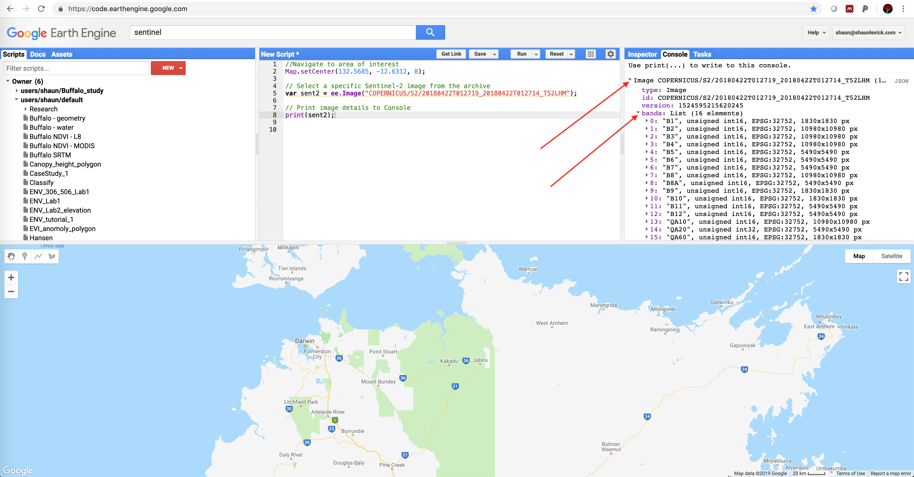
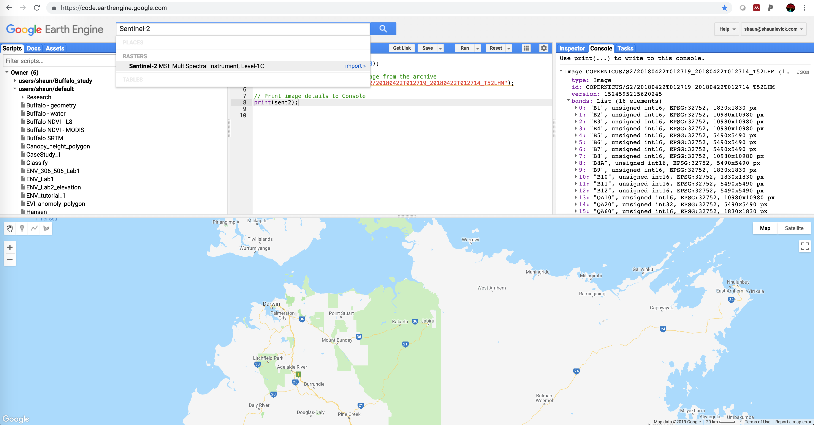
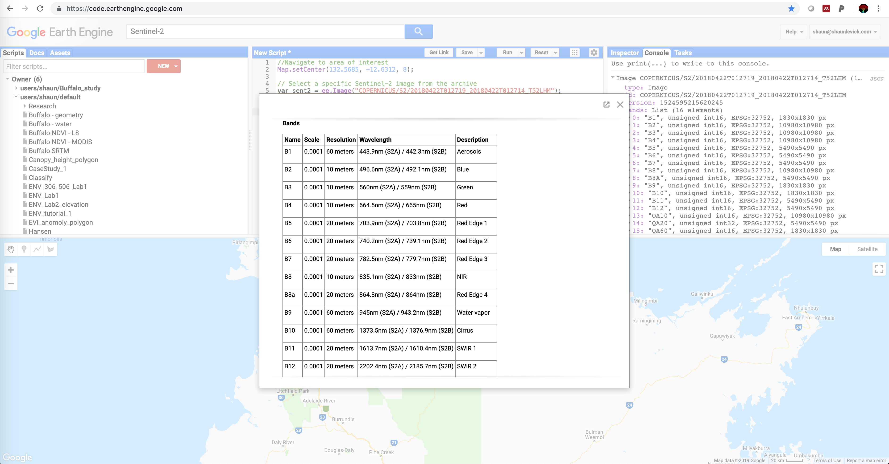
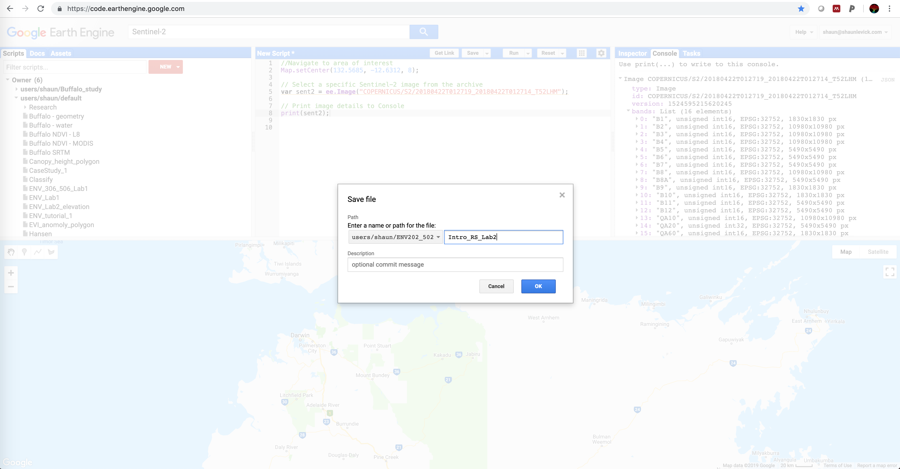
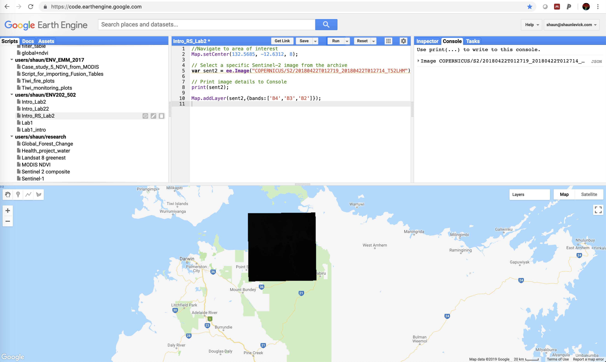
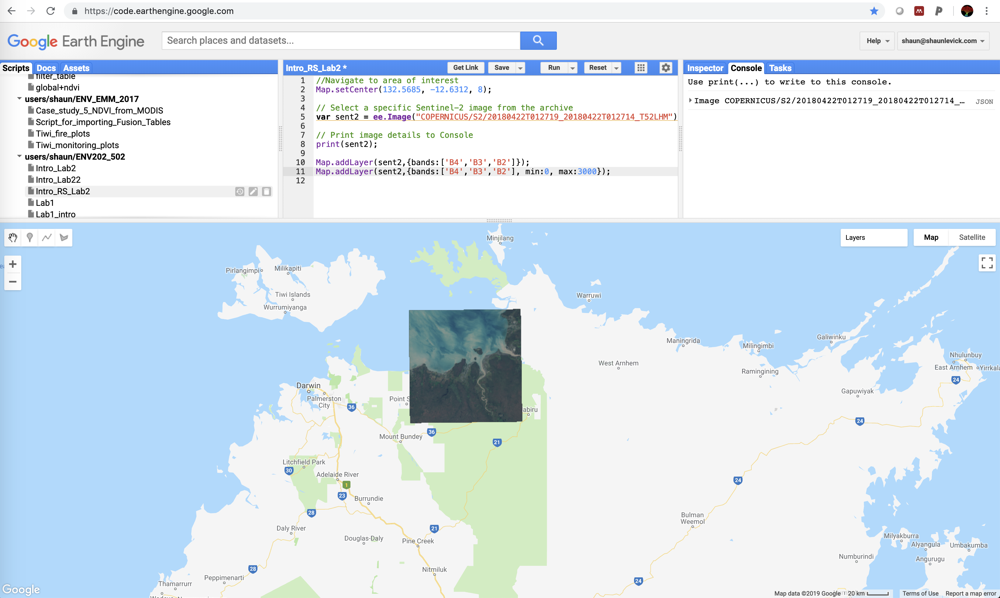
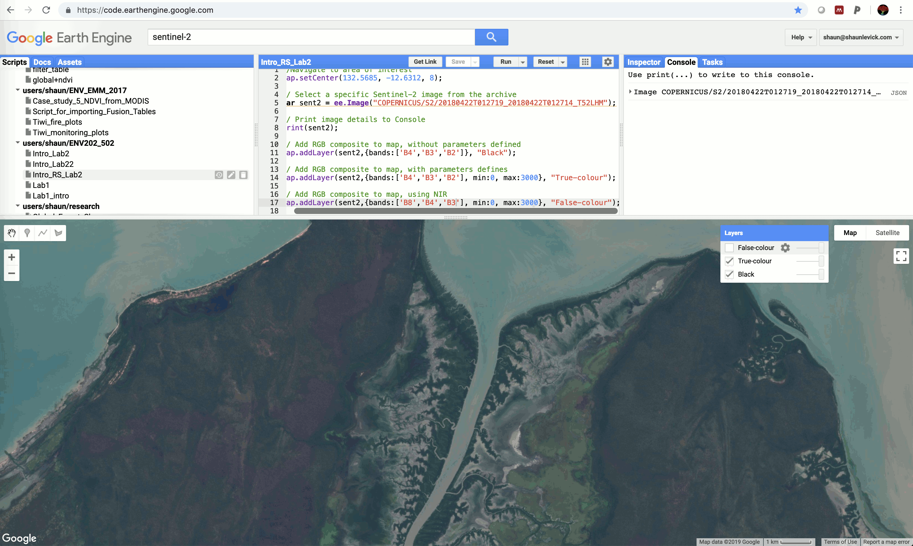
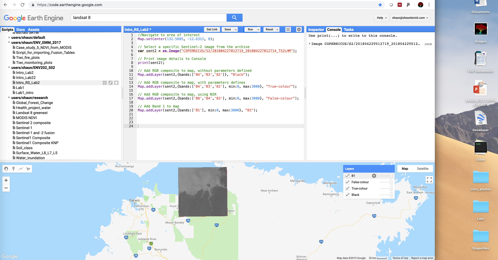

GEARS - Geospatial Engineering and Remote Sensing lab - https://www.gears-lab.com

# Introduction to Remote Sensing of the Environment
Lab 2 - Understanding band combinations and image visualisations
--------------

### Acknowledgments
- Google Earth Engine Team
- Google Earth Engine Developers group

------

### Prerequisites
-------------

Completion of this lab exercise requires use of the Google Chrome browser and a Google Earth Engine account. If you have not yet signed up - please do so now in a new tab:

[Earth Engine account registration](https://signup.earthengine.google.com/)

Once registered you can access the Earth Engine environment here:
https://code.earthengine.google.com

Google Earth Engine uses the JavaScript programming language. We will cover the very basics of this language during this course. If you would like more detail you can read through the introduction provided here:

[JavaScript background](https://developers.google.com/earth-engine/tutorial\_js\_01)

------------------------------------------------------------------------

### Objective


The objective of this lab is to strengthen your understanding of image visualisation principles, and develop practical skills in mapping band combinations and exploring reflectance spectra.


## Loading a Sentinel-2 multispectral image

1. For this lab we will use a multi-spectral image collected by the European Space Agency's Sentinel-2 satellite. Sentinel-2 is a wide-swath, high-resolution, multi-spectral imaging mission supporting Copernicus Land Monitoring studies, including the monitoring of vegetation, soil and water cover, as well as observation of inland waterways and coastal areas. We will use an image collected over Kakadu National Park, Australia.

2. Let's navigate to the area of interest (Kakadu) by copying the code below into the Code Editor and clicking "Run". Remember that the line starting with // is a note to ourselves and to others, and is not processed (we call this a comment). The numbers in brackets are the longitude, latitude, and zoom level (range is from 1 to 22).

```JavaScript
//Navigate to area of interest
Map.setCenter(132.5685, -12.6312, 8);
```


3. Now that we are in the right place, let's choose a Sentinel-2 image using the code below. Copy and paste into the Code Editor and click "Run". Copernicus refers to the satellite mission, S2 is short for Sentinel-2, and the long number 20180422T012719_20180422T012714_T52LHM refers to a specific image, defined by a date, time and a path and row of the satellite's orbit. I have chosen a single image for the purposes of this lab, but we will cover searching for images for specific areas and dates at a later stage.

```JavaScript
// Select a specific Sentinel-2 image from the archive
var sent2 = ee.Image("COPERNICUS/S2/20180422T012719_20180422T012714_T52LHM");
```

4. If the code did not return any errors, then the image was successfully found in the archive. To double check, let's run the line below to print the image information to the Console. Once the information loads in the Console, you can click the little dropdown arrows next to "Image" and "bands" to see more details about the band structure and naming format.

```JavaScript
// Print image details to the Console
print(sent2);
```



5. We can see from the Console information that the image contains multiple bands, called B1, B2, B3 etc. To find out which wavelengths these bands represent, lets use the seach bar to find out more information. Type "Sentinel-2" in to the search bar and you will see it appear in the results list.



6. Click on "Sentinel-2 MSI: MultiSpectral Instrument, Level 1-C" to open the information panel. The table provided is very useful for gaining a quick overview of the available bands, their wavelengths and spatial resolutions.



7. Now before we go any further, please save your current script by clicking the drop down on the Save button, and selecting "Save as". Save it into your course repository so that you can come back to it at any stage, and from any device with a web browser.



8. Getting back to our image, Bands 2,3 and 4 are the blue, green and red bands respectively. Therefore if we wish to view a true-colour rendering of the image - i.e. an RGB composite, we need to place Band 4 into the red channel, Band 3 into the green channel, and Band 2 into the blue channel. We can do this with the code below - take careful note of the syntax for specifying the band arrangement.

```JavaScript
Map.addLayer(sent2,{bands:['B4','B3','B2']});
```



9. After running the previous line of code, we can see that an image loads in the map viewer but it is completely dark. This is because we did not specify any visualisation parameters. Reflectance values for Sentinel-2 products range from 0 to 3000, so let's specify this in our code like shown below (noting that all visualisation parameters are inside the {} brackets):


```JavaScript
Map.addLayer(sent2,{bands:['B4','B3','B2'], min:0, max:3000});
```



10. That looks better, this is a view similar to what we would see looking out of the window of an airplane - which is why we call it a true-colour composite. All three of the bands used in creating this composite occur in the visible portion of the electromagnetic spectrum.

11. Zoom in a bit closer using the wheel of your mouse. These images are a fantastic resource for environmental mapping and monitoring. The visible spectrum bands are at 10m spatial resolution, and the revisit time of the satellite constellation is every 6 days in this region. Thanks ESA!


12. Before we go any further lets clean up our code a bit. We didn't comment the last two lines - let's fix that, and let's give titles to the layers in the map view so that we know which is which in the layer tab. We can paste these lines over the previous two.

```JavaScript
// Add RGB composite to map, without parameters defined
Map.addLayer(sent2,{bands:['B4','B3','B2']}, "Black");

// Add RGB composite to map, with parameters defined
Map.addLayer(sent2,{bands:['B4','B3','B2'], min:0, max:3000}, "True-colour");
```


13. If look back to the table of Sentinel-2 wavelengths, we can see that Band 8 is in the NIR (near infra-red) spectrum. Therefore, to map a false-colour composite we need to put Band 8 into the red channel, move Band 4 into the green channel, and move Band 3 into the blue channel. The resulting image now shows photosynthetically active vegetation in vibrant red.

```JavaScript
// Add RGB composite to map, using NIR for false-colour
Map.addLayer(sent2,{bands:['B8','B4','B3'], min:0, max:3000}, "False-colour");
```


14. Now you can navigate around the scene and flip between the true-colour and false-colour views using the layers tab. Take careful note of how different parts of the scene are represented in these different visualisations - and explore how some features, like burn scars, jump out more clearly in the false-colour composite.



15. To really build your understanding of how different wavelengths interact with surfaces, we are now going to load individual bands sequentially, from shorter to longer wavelengths. To display Band 1, the code is as follows:

```JavaScript
// Add Band 1 to map
Map.addLayer(sent2,{bands:['B1'], min:0, max:3000}, "B1");
```


16. To display more the bands individually, the code is the same - e.g.:

```JavaScript
// Add a few more bands to map
Map.addLayer(sent2,{bands:['B4'], min:0, max:3000}, "B4");
Map.addLayer(sent2,{bands:['B8'], min:0, max:3000}, "B18");
Map.addLayer(sent2,{bands:['B12'], min:0, max:3000}, "B12");
```
17. Use the layers tab to turn band off and on in the map display view. Take note of which landscape elements appear brighter and darker as you change band number (and therefore wavelength).

------
### Practical exercise

1. Load up another Sentinel-2 image for the same area of interest. The code below contains the image identifier for an image collected in August 2018.

```JavaScript
// Select a specific Sentinel-2 image from the archive
var sent2dry = ee.Image("COPERNICUS/S2/20180810T012709_20180810T012711_T52LHM");
```
2. Visualise this image in true-colour and false-colour.

3. Compare the August image with the one from April. What has changed and why?

4. So far we have only explored two visualisation options (true-colour and false-colour), but there are many more possible RGB combinations:
    - Natural colour: 4 3 2
    - False colour infrared: 8 4 3
    - False colour urban: 12 11 4
    - Agriculture: 11 8 2
    - Atmospheric penetration: 12 11 8a
    - Healthy vegetation: 8 11 2
    - Land/Water: 8 11 4
    - Natural colours with atmospheric removal: 12 8 3
    - Shortwave infrared: 12 8 4
    - Vegetation analysis: 11 8 4

5. Experiment with the combinations listed above and think about why we might want to use them.

-------
### Thank you

I hope you found that useful. A recorded video of this tutorial can be found on my YouTube Channel's [Introduction to Remote Sensing of the Environment Playlist](https://www.youtube.com/playlist?list=PLf6lu3bePWHDi3-lrSqiyInMGQXM34TSV) and on my lab website [GEARS](https://www.gears-lab.com).

#### Kind regards, Shaun R Levick
------
