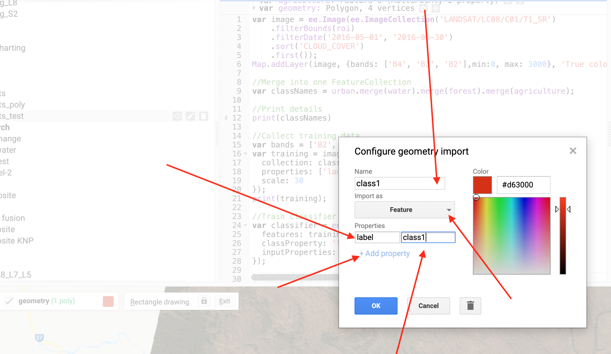
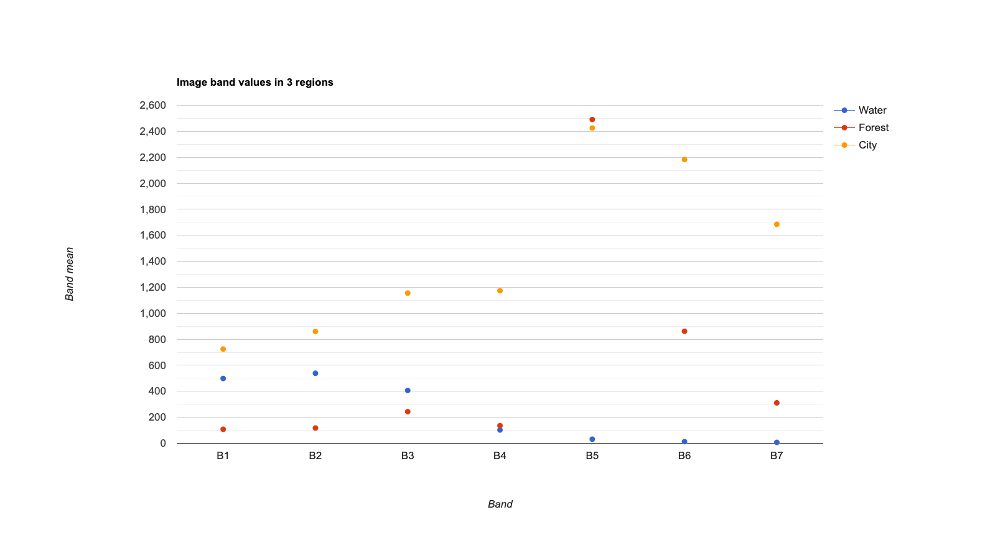
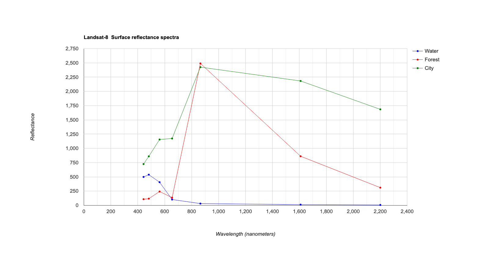

GEARS - Geospatial Engineering and Remote Sensing lab - https://www.gears-lab.com

# Introduction to Remote Sensing of the Environment
Lab 5 - Image Classification - part 2
--------------

### Acknowledgments
- Google Earth Engine Team
- Google Earth Engine Developers group

------

### Prerequisites
-------------

Completion of this lab exercise requires use of the Google Chrome browser and a Google Earth Engine account. If you have not yet signed up - please do so now in a new tab:

[Earth Engine account registration](https://signup.earthengine.google.com/)

Once registered you can access the Earth Engine environment here:
https://code.earthengine.google.com

This lab follows on from others in this series:

[Lab 1](https://github.com/geospatialeco/GEARS/blob/master/Intro_RS_Lab1.md) -
[Lab 2](https://github.com/geospatialeco/GEARS/blob/master/Intro_RS_Lab2.md) -
[Lab 3](https://github.com/geospatialeco/GEARS/blob/master/Intro_RS_Lab3.md) -
[Lab 4](https://github.com/geospatialeco/GEARS/blob/master/Intro_RS_Lab4.md) -

------------------------------------------------------------------------

### Objective


The objective of this lab is to further your understanding of the image classification process, and improve the classification from last week. While doing this we will also cover some useful tips and tricks - including working with polygons and charting spectra.

----------

## Load up your previous classification from last week

Open you script from last week's lab. If you did not save it, repeat the steps from [Lab 4](https://github.com/geospatialeco/GEARS/blob/master/Intro_RS_Lab4.md) and be sure to save it this time.

I have provided the full code below, but remember that you need to manually collect the training data and assign landcover properties.

```JavaScript
//Filter image collection for time window, spatial location, and cloud cover
var image = ee.Image(ee.ImageCollection('LANDSAT/LC08/C01/T1_SR')
    .filterBounds(roi)
    .filterDate('2016-05-01', '2016-06-30')
    .sort('CLOUD_COVER')
    .first());

//Add true-clour composite to map
Map.addLayer(image, {bands: ['B4', 'B3', 'B2'],min:0, max: 3000}, 'True colour image');

//Merge features into one FeatureCollection
var classNames = urban.merge(water).merge(forest).merge(agriculture);

//Select bands to use
var bands = ['B2', 'B3', 'B4', 'B5', 'B6', 'B7'];

//Sample the reflectance values for each training point
var training = image.select(bands).sampleRegions({
  collection: classNames,
  properties: ['landcover'],
  scale: 30
});

//Train the classifier - in this case using a CART regression tree
var classifier = ee.Classifier.cart().train({
  features: training,
  classProperty: 'landcover',
  inputProperties: bands
});

//Run the classification
var classified = image.select(bands).classify(classifier);

//Display the classification map
Map.centerObject(classNames, 11);
Map.addLayer(classified,
{min: 0, max: 3, palette: ['red', 'blue', 'green','yellow']},
'classification');
```


-----
## Improving the Classification

We ended last week with a discussion on whether or not we were happy with this classification. Even without any quantitative data, it was clearly lacking in some regions. How can we improve it? There are a few option we can explore:

1. Change the training sample size. We only sampled 25 pixels per class. This was a lot of clicking, but we could use polygons instead of points to sample more pixels for training.
2. Change the sampling strategy. We collected an even number of points per class, but some landcover class cover much more area than others. We could experiment with a stratified sampling approach instead.
3. Change the classifier. We used a CART classifier, we could try a different approach such as a support vector machine (SVM) or RandomForest approach.
4. Change the bands. We could add ancillary information, such as elevation data, or a derived index such as NDVI to provide for information for class discrimination.
5. Change the image. We used a winter scene from Landsat-8. We could try a summer scene, or switch to a Sentinel-2 image.

## Plotting spectra for different landcover classes

A very useful step in any classification is understanding how separable the classes are based on their spectral response curves. We have explored this already by clicking on individual pixels and looking at the reflectance bar-charts in the console. But how can we explore multiple pixels and classes at the same time? We need to summarise the information and plot it as a graph.

Save your work and clear the script. Load up a Landsat-8 image for a roi of your choice (remember to position a point on the map and call it roi)

```JavaScript
//Filter image collection for time window, spatial location, and cloud cover
var image = ee.Image(ee.ImageCollection('LANDSAT/LC08/C01/T1_SR')
    .filterBounds(roi)
    .filterDate('2016-05-01', '2016-06-30')
    .sort('CLOUD_COVER')
    .first());

//Add true-clour composite to map
Map.addLayer(image, {bands: ['B4', 'B3', 'B2'],min:0, max: 3000}, 'True colour image');
```

First we will specify which bands to use, and create new polygons for three classes (Water, Forest, City) we want to explore. Change the geometry type to Feature and and define a 'label' in the properties tab.



```JavaScript
//Choose bands to include and define feature collection to use
var subset = image.select('B[1-7]')
var samples = ee.FeatureCollection([Water,Forest,City]);
```

Now we can create a chart variable and then print it to the console. We use the image.regions function to summarise by class region, and the ee.Reducer.mean() function to obtain the mean reflectance value for each class for each band.


```JavaScript
// Create the scatter chart
var Chart1 = ui.Chart.image.regions(
    subset, samples, ee.Reducer.mean(), 10, 'label')
        .setChartType('ScatterChart');
print(Chart1);
```



We can improve the readability of our chart by specifying some display options.

```JavaScript
// Define customization options.
var plotOptions = {
  title: 'Landsat-8  Surface reflectance spectra',
  hAxis: {title: 'Wavelength (nanometers)'},
  vAxis: {title: 'Reflectance'},
  lineWidth: 1,
  pointSize: 4,
  series: {
    0: {color: 'blue'}, // Water
    1: {color: 'green'}, // Forest
    2: {color: 'red'}, // City
}};
```

And we can print the actual band wavelengths on the x-axis using this:

```JavaScript
// Define a list of Landsat-8 wavelengths for X-axis labels.
var wavelengths = [443, 482, 562, 655, 865, 1609, 2201];
```

```Create the chart with more options
// Create the chart and set options.
var Chart2 = ui.Chart.image.regions(
    subset, samples, ee.Reducer.mean(), 10, 'label', wavelengths)
        .setChartType('ScatterChart')
        .setOptions(plotOptions);
// Display the chart.
print(Chart2);
```


## Exercises

- Try and run a supervised classification and plot spectra for a Sentinel-2 image, instead of a Landsat-8 one

-------
### Thank you

I hope you found that useful. A recorded video of this tutorial can be found on my YouTube Channel's [Introduction to Remote Sensing of the Environment Playlist](https://www.youtube.com/playlist?list=PLf6lu3bePWHDi3-lrSqiyInMGQXM34TSV) and on my lab website [GEARS](https://www.gears-lab.com).

#### Kind regards, Shaun R Levick
------
