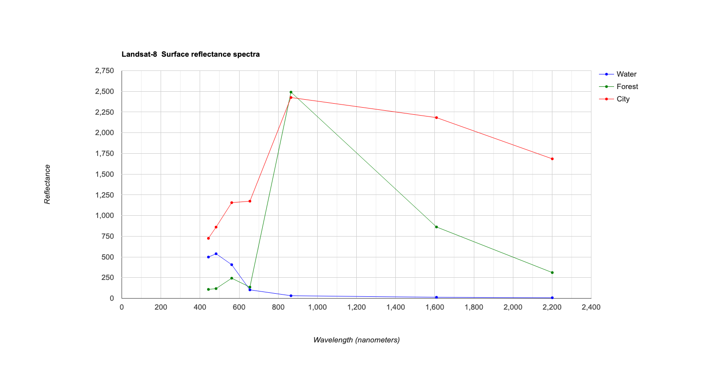

GEARS - Geospatial Engineering and Remote Sensing lab - https://www.gears-lab.com

# Introduction to Remote Sensing of the Environment
Lab 6 - Plotting spectral response curves
--------------

### Acknowledgments
- Google Earth Engine Team
- Google Earth Engine Developers group

------

### Prerequisites
-------------

Completion of this lab exercise requires use of the Google Chrome browser and a Google Earth Engine account. If you have not yet signed up - please do so now in a new tab:

[Earth Engine account registration](https://signup.earthengine.google.com/)

Once registered you can access the Earth Engine environment here:
https://code.earthengine.google.com

This lab follows on from others in this series:

[Lab 1](https://github.com/geospatialeco/GEARS/blob/master/Intro_RS_Lab1.md) -
[Lab 2](https://github.com/geospatialeco/GEARS/blob/master/Intro_RS_Lab2.md) -
[Lab 3](https://github.com/geospatialeco/GEARS/blob/master/Intro_RS_Lab3.md) -
[Lab 4](https://github.com/geospatialeco/GEARS/blob/master/Intro_RS_Lab4.md) -
[Lab 5](https://github.com/geospatialeco/GEARS/blob/master/Intro_RS_Lab5.md)
------------------------------------------------------------------------

### Objective


The objective of this lab is to further your understanding of spectral responses, and develop skills in using the Charting functions in Earth Engine (JavaScript).

----------

## Load up a Landsat-8 scene
1. Navigate to an area of interest for you.
2. Place a point marker on the map and rename it "roi".
3. Run the code below to pull up a cloud free image for a specific date range (adjust as needed).


```JavaScript
//Filter image collection for time window, spatial location, and cloud cover
var image = ee.Image(ee.ImageCollection('LANDSAT/LC08/C01/T1_SR')
    .filterBounds(roi)
    .filterDate('2016-05-01', '2016-06-30')
    .sort('CLOUD_COVER')
    .first());

//Add true-clour composite to map
Map.addLayer(image, {bands: ['B4', 'B3', 'B2'],min:0, max: 3000}, 'True colour image');
```

First we will specify which bands to use, and create new polygons for three classes (Water, Forest, City) we want to explore. Change the geometry type to Feature and and define a 'label' in the properties tab.


```JavaScript
//Choose bands to include and define feature collection to use
var subset = image.select('B[1-7]')
var samples = ee.FeatureCollection([Water,Forest,City]);
```

Now we can create a chart variable and then print it to the console. We use the image.regions function to summarise by class region, and the ee.Reducer.mean() function to obtain the mean reflectance value for each class for each band.


```JavaScript
// Create the scatter chart
var Chart1 = ui.Chart.image.regions(
    subset, samples, ee.Reducer.mean(), 10, 'label')
        .setChartType('ScatterChart');
print(Chart1);
```


We can improve the readability of our chart by specifying some display options.

```JavaScript
// Define customization options.
var plotOptions = {
  title: 'Landsat-8  Surface reflectance spectra',
  hAxis: {title: 'Wavelength (nanometers)'},
  vAxis: {title: 'Reflectance'},
  lineWidth: 1,
  pointSize: 4,
  series: {
    0: {color: 'blue'}, // Water
    1: {color: 'green'}, // Forest
    2: {color: 'red'}, // City
}};
```

And we can print the actual band wavelengths on the x-axis using this:

```JavaScript
// Define a list of Landsat-8 wavelengths for X-axis labels.
var wavelengths = [443, 482, 562, 655, 865, 1609, 2201];
```

```Create the chart with more options
// Create the chart and set options.
var Chart2 = ui.Chart.image.regions(
    subset, samples, ee.Reducer.mean(), 10, 'label', wavelengths)
        .setChartType('ScatterChart')
        .setOptions(plotOptions);
// Display the chart.
print(Chart2);
```


## Exercises

- Try and run a supervised classification and plot spectra for a Sentinel-2 image, instead of a Landsat-8 one.
- Experiment with clipping your maps to specific boundaries.

Hint: you can use .clip(polygon) to clip a map of an image to the shape of a geometry called "polygon".

```JavaScript
Map.addLayer(image.clip(polygon), {bands: ['B4', 'B3', 'B2'],min:0, max: 3000}, 'True colour image');
```


-------
### Thank you

I hope you found that useful. A recorded video of this tutorial can be found on my YouTube Channel's [Introduction to Remote Sensing of the Environment Playlist](https://www.youtube.com/playlist?list=PLf6lu3bePWHDi3-lrSqiyInMGQXM34TSV) and on my lab website [GEARS](https://www.gears-lab.com).

#### Kind regards, Shaun R Levick
------
