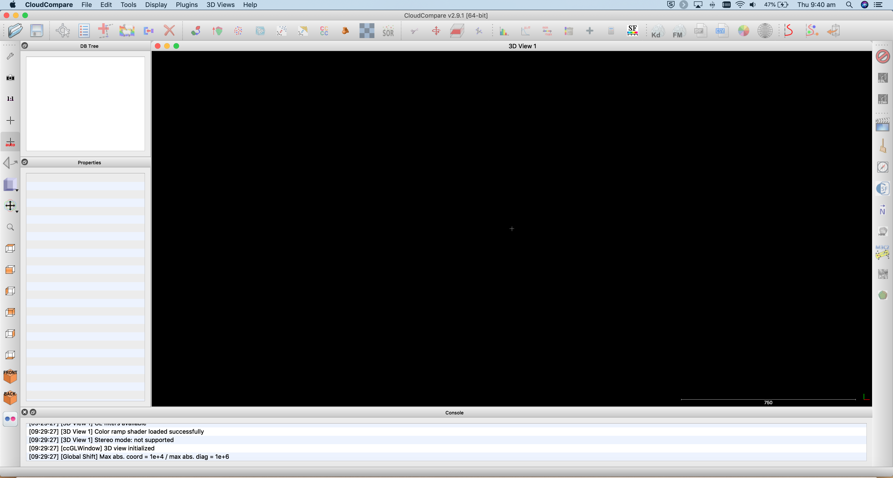
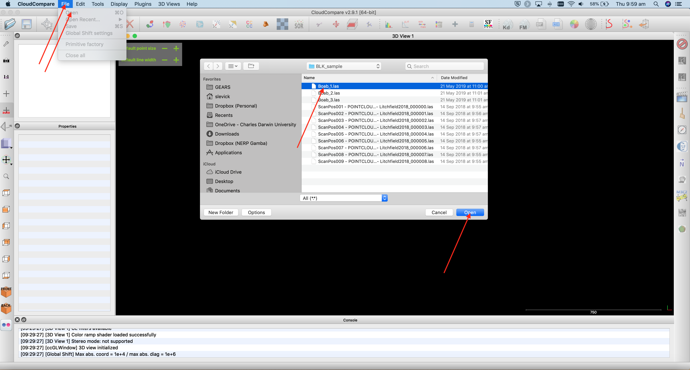
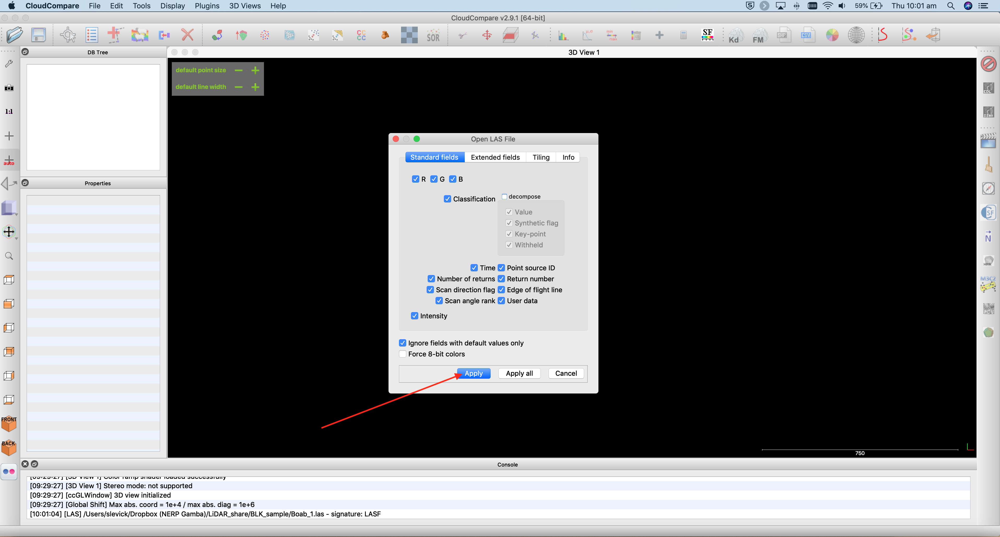
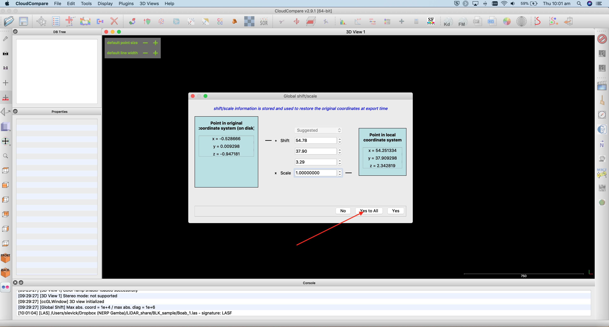
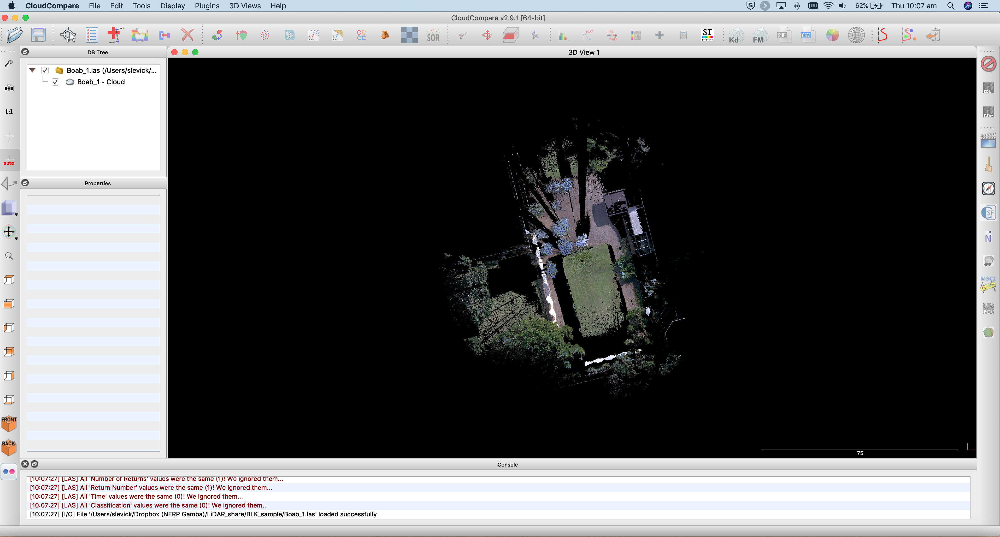

GEARS - Geospatial Engineering and Remote Sensing lab - https://www.gears-lab.com

# Introduction to Remote Sensing of the Environment
Lab 9 - Working with Terrestrial Laser Scanning (TLS) data in CloudCompare
--------------

### Prerequisites
-------------

Completion of this lab exercise requires use of the CloudCompare software package. CloudCompare is a powerful package for visualising and processing point-clouds, and best of all is open-access. You can download the version to match your operating system here:

https://www.danielgm.net/cc/

------------------------------------------------------------------------

### Background and objective

The objective of this lab is to familiarise yourself with 3D point cloud data. We will use data that we collected last week on campus in the Boab court. We collected multiple scans with a Leica BLK360 laser scanner, and we will work with some of these scans today.

Scan data can be downloaded in .las format here (please note that each file is ~ 1GB):

[Scan 1](https://www.dropbox.com/s/e172wfagzt50qfm/Boab_1.las?dl=0) | [Scan 2](https://www.dropbox.com/s/faa42pr89rdc7g6/Boab_2.las?dl=0) | [Scan 3](https://www.dropbox.com/s/pta1p7h50gta434/Boab_3.las?dl=0)

----------

## Getting to know CloudCompare

1. Launch the CloudCompare application.

2. Note that your interface might look a bit different to mine if you are on a Windows machine - but don't worry the tools and menus are consistent across platforms.

3. Open up the first scan by clicking File>Open, navigate to where you saved the data, and click on Boab_1.las

4. A window will appear asking if you would like to apply default settings - click Apply

5. Another window will appear asking you about coordinate transformations - click Yes

6. A progress bar should appear showing you how many points are being ingested (28 million in this case) and then the point cloud should appear in the main viewing window.

### Thank you

I hope you found that useful. A recorded video of this tutorial can be found on my YouTube Channel's [Introduction to Remote Sensing of the Environment Playlist](https://www.youtube.com/playlist?list=PLf6lu3bePWHDi3-lrSqiyInMGQXM34TSV) and on my lab website [GEARS](https://www.gears-lab.com).

#### Kind regards, Shaun R Levick
------
