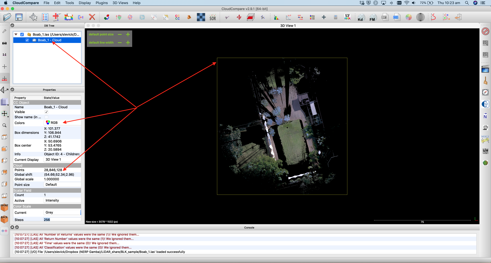
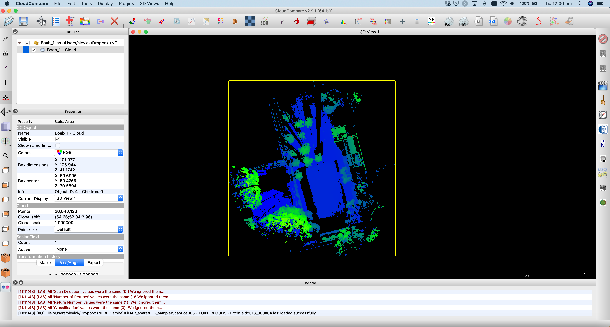
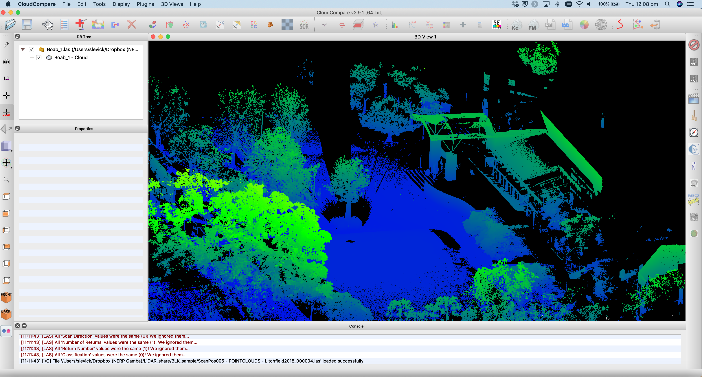
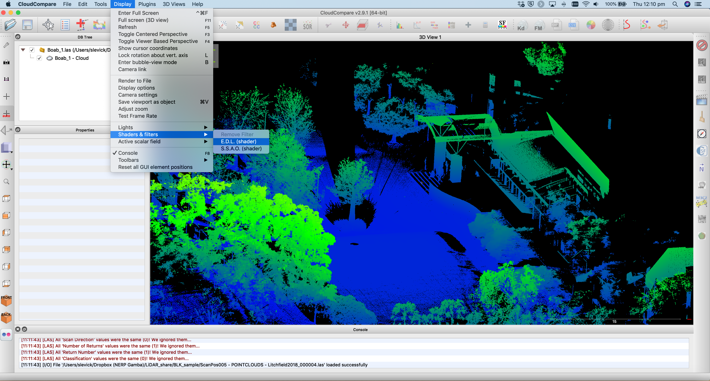

GEARS - Geospatial Engineering and Remote Sensing lab - https://www.gears-lab.com

# Introduction to Remote Sensing of the Environment
Lab 9 - Working with Terrestrial Laser Scanning (TLS) data in CloudCompare
--------------

### Prerequisites
-------------

Completion of this lab exercise requires use of the CloudCompare software package. CloudCompare is a powerful package for visualising and processing point-clouds, and best of all is open-access. You can download the version to match your operating system here:

https://www.danielgm.net/cc/

------------------------------------------------------------------------

### Background and objective

The objective of this lab is to familiarise yourself with 3D point cloud data. We will use data that we collected last week on campus in the Boab court. We collected multiple scans with a Leica BLK360 laser scanner, and we will work with some of these scans today.

Scan data can be downloaded in .las format here (please note that each file is ~ 1GB):

[Scan 1](https://www.dropbox.com/s/e172wfagzt50qfm/Boab_1.las?dl=0) | [Scan 2](https://www.dropbox.com/s/faa42pr89rdc7g6/Boab_2.las?dl=0) | [Scan 3](https://www.dropbox.com/s/pta1p7h50gta434/Boab_3.las?dl=0)

----------

## Getting to know CloudCompare

1. Launch the CloudCompare application.

2. Note that your interface might look a bit different to mine if you are on a Windows machine - but don't worry the tools and menus are consistent across platforms.

3. Open up the first scan by clicking File>Open, navigate to where you saved the data, and click on Boab_1.las

4. A window will appear asking if you would like to apply default settings - click Apply

5. Another window will appear asking you about coordinate transformations - click Yes

6. A progress bar should appear showing you how many points are being ingested (28 million in this case) and then the point cloud should appear in the main viewing window as shown below.

7. The top-left panel houses the file structure. Click on Bao_1.las and you will see some information appear in the panel below it, and the spatial extent of the file will be highlighted in the main window. In the properties panel (lower left) we can see that the current display options are set to RGB (the Leica BLK360 captures true-colour images in addition to laser data) and that there are 28,846,128 points in this cloud.

8. Let's zoom in a bit closer to see more detail. Hold your mouse over the main viewing window and use the scroll wheel to zoom in and out.

9. As you can see, we are looking down on our scan from above - a bird's eye perspective. The green lawn is clearly visible, and the black dot in the location where the scanner was placed (the scanner does not scan directly beneath itself). See what other features you can identify - the boab trees, building, sun-shades etc.

10. Although this aerial view is interesting, we currently have a 2D view. The reason we use LiDAR is for a 3D perspective - so use your LEFT mouse button to click and tilt the scene. Your RIGHT mouse button will pan the image (up, down, left, right) and the SCROLL WHEEL is for zooming in and out.

11. The 3D navigation takes a while to get used to. Play around a bit to get the hang of it - and try navigate to the view shown below. You can see your fellow students waiting in the shade on the steps of the Mal Nairn Auditorium.

12. If at some stage you get lost in the scene, you can use the 1:1 button to return to an aerial view of the full spatial extent.

13. So far we have been visualising the TLS data in RGB - that is the reflectance values recored by the camera are being given to each point. We see some issue with this in the tips of tree branches whereby the blue colour of the sky is given to the thin branches of the boab trees. This is partly due to the camera resolution being coarser than the laser resolution.

14. Since the TLS is recording distance to objects in x,y and z coordinates, we can also visualise the cloud in terms of elevation. With the file selected in the top-left panel, click Edit>Colours>Height ramp from the main menu.

15. A new window will appear where you can apply a colour scale to the elevation data. Use the default options and click OK

16. The point cloud will now be rendered with a default colour scale showing lower elevation points in blue and taller points in green.

17. Zoom in a bit to see the effect in 3D.

18. To create a more 3D textured look we can use a light shader. Using the main menu navigate to
Display>Shaders & filters and turn on the E.D.L shader.

19. This results in a visualisation with more depth/texture.

## Merging multiple scans

20. Close your current scans.
21. Next we will load up two scans and go through how to merge them. For this exercise we will use Boab_1.las and Boab_3.las. Open both scans in CloudCompare.

### Updates still in progress......

### Thank you

I hope you found that useful. A recorded video of this tutorial can be found on my YouTube Channel's [Introduction to Remote Sensing of the Environment Playlist](https://www.youtube.com/playlist?list=PLf6lu3bePWHDi3-lrSqiyInMGQXM34TSV) and on my lab website [GEARS](https://www.gears-lab.com).

#### Kind regards, Shaun R Levick
------
