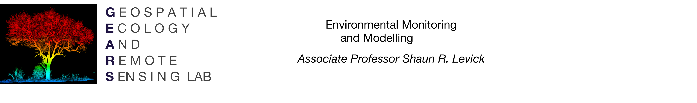
GEARS - Geospatial Ecology and Remote Sensing lab - https://www.geospatialecology.com

# Environmental Monitoring and Modelling
## Lab 1 - Introduction to Google Earth Engine

------

## Prerequisites

Completion of this lab exercise requires use of the Google Chrome browser and a Google Earth Engine account. If you have not yet signed up - please do so now:

https://signup.earthengine.google.com/

Google Earth Engine uses the JavaScript programming language. We will cover the very basics of this language during this course. If you would like more detail you can read through the introduction provided here:

https://developers.google.com/earth-engine/tutorial\_js\_01

--------

## Objective

The objective of this lab is to give you an introduction to the Google Earth Engine processing environment. By the end of this exercise you will be able to search, find and visualize a broad range of remotely sensed datasets. We will focus on Sentinel-2 data for this first exercise, and learn to display imagery as true colour and false colour composites. We will also learn how to calculate NDVI from multi-spectral imagery.

---------

## Searching for and importing a cloud-free Sentinel-2 imagery

SENTINEL-2 is a wide-swath, high-resolution, multi-spectral imaging mission supporting Copernicus Land Monitoring studies, including the monitoring of vegetation, soil and water cover, as well as observation of inland waterways and coastal areas. SENTINEL-2 was developed and operated by the European Space Agency, and has been sending data back to Earth since 23 June 2015.

The SENTINEL-2 data contain 13 spectral bands representing TOA reflectance scaled by 10000.

Lets load a Sentinel-2 scene over Darwin, Australia, into Google Earth Engine to see what it looks like. Follow the commands below step-by-step - if you get stuck or can’t follow from these instructions alone, then watch the accompanying video which I have uploaded here. _Video Link_.

Open up the Google Earth Engine environment by going to this address in your Chrome browser:

https://code.earthengine.google.com

You will see that the GEE environment is divided up into four panels:
1. an organization panel with tabs for Scripts, Docs and Assets
2. a coding panel for writing and running Javascript commands
3. the Console panel with tabs for the Inspector and Tasks
4. the map interface which will look very familiar


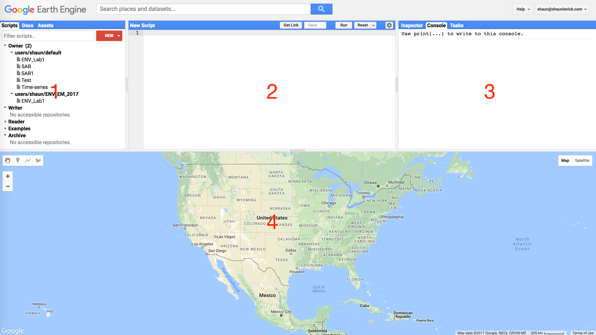


- Just above the Coding panel is  search bar. Search for ‘Darwin’ in this GEE search bar, and click the result to pan and zoom the map to Darwin (Figure 2).


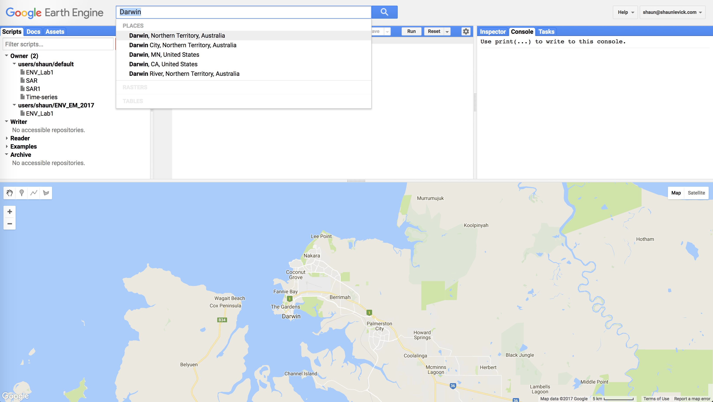


- Use the geometry tools to make a point on Casuarina campus of Charles Darwin University (located in the suburb of Brinkin, north of Rapid Creek). Once you create the geometry point, you will see it added to your Coding panel as a variable (var) under the Imports heading.


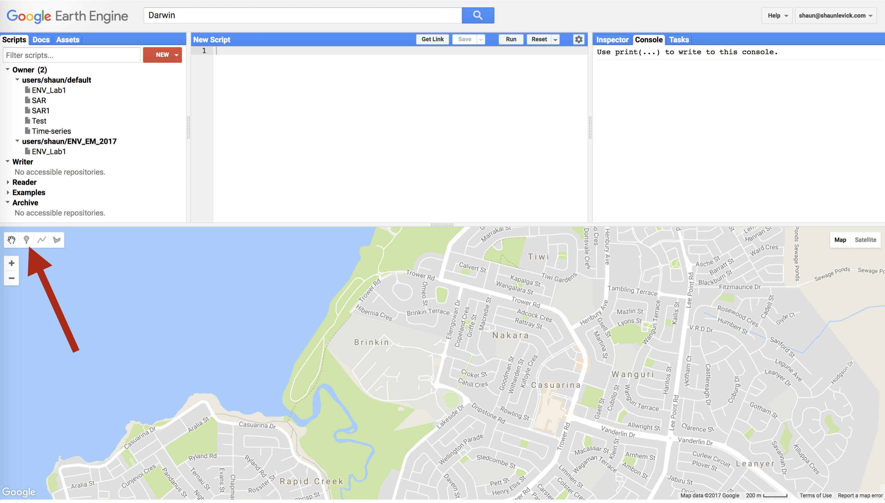

- Rename the resulting point ‘campus’ by clicking the import name (which is called ‘geometry’ by default).

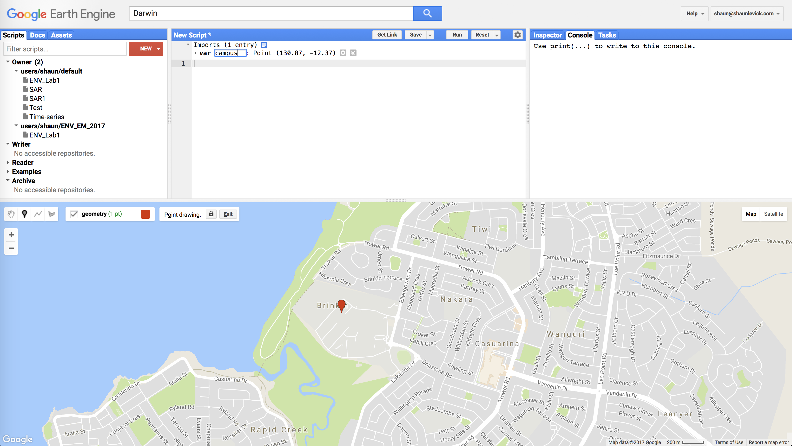


- Search for ‘Sentinel-2’ in the search bar. In the results section you will see ‘Sentinel-2: Multi-spectral Instrument (MSI), Level-1C’ - click on it and then click the ‘Import’ button.

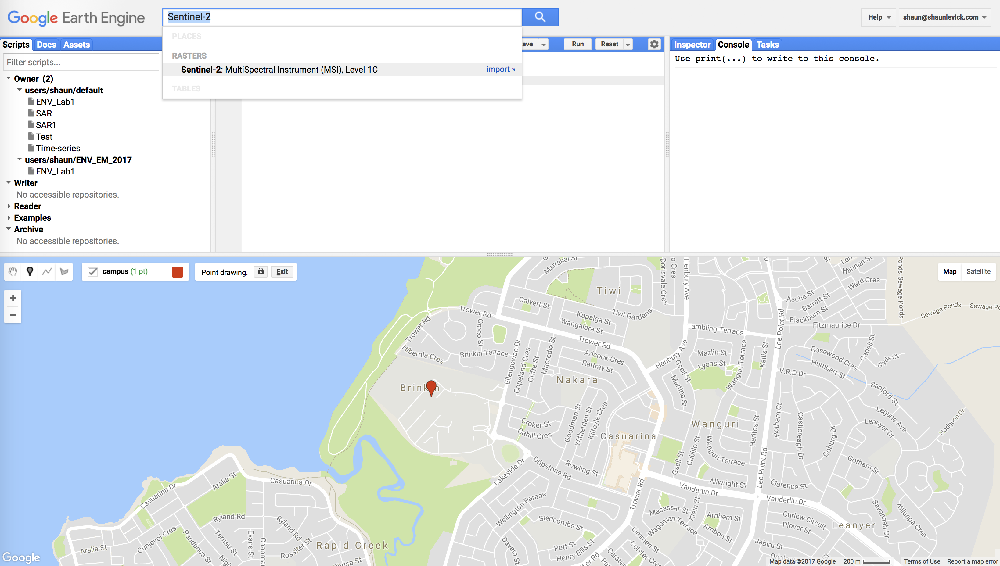


- After clicking import, Sentinel-2 will be added to our Imports in the Coding panel as a variable. It will be listed below our campus geometry point with the default name "imageCollection". Let's rename this to “sent2” by clicking on imageCollection and typing "sent2".

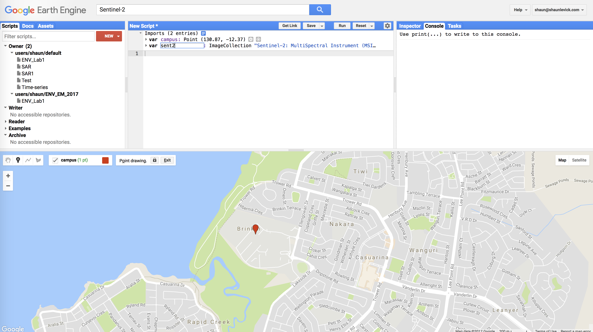

It is important to understand that we have now added access to the full Sentinel-2 image collection (i.e. every image that has been collected to date) to our script. For this exercise we don't want to load all these images - we want a single cloud free image over Charles Darwin University. As such, we can now filter the image collection with a few criteria, such as time of acquisition, spatial location and cloud cover.

---------

##Filtering image collections

To achieve this we need to use a bit of coding. In the JavaScript programming language two backslashes (//) indicate comment lines and are ignored in actual processing steps. We use // to write notes to ourselves in our code, so that we (and others who might want to use our code) can understand why we have done certain things.

```{js}
// This is our first line of code. Let’s define the image collection we are working with by writing this command
    var image = ee.Image(sent2

    // We will then include a filter to get only images in the date range we are interested in
    .filterDate("2015-07-01", "2017-09-30")

    // Next we include a geographic filter to narrow the search to images at the location of our point
    .filterBounds(campus)

    // Next we will also sort the collection by a metadata property, in our case cloud cover is a very useful one
    .sort("CLOUD_COVERAGE_ASSESSMENT")

    // Now lets select the first image out of this collection - i.e. the most cloud free image in the date range
    .first());

    // And let's print the image to the console.
    print("A Sentinel-2 scene:", image);
```

You need to copy the entire piece of code above and paste it in the “New script” box of the GEE code editor. Then click the "Run" button and watch Google do its magic.....

This piece of code will search the full Sentinel-2 archive, find images that are located over Darwin, sort them according to percentage cloud cover, and then return the most recent cloud free image for us. Information relating to this image will be printed to the Console, where it is listed as "A Sentinel-2 scene" with some details about that scene(COPERNICUS/S2/20160629T014038\_20160629T062926\_T52LFM (16 bands)). We know from the scene name that is was collected on the 29th June 2016.

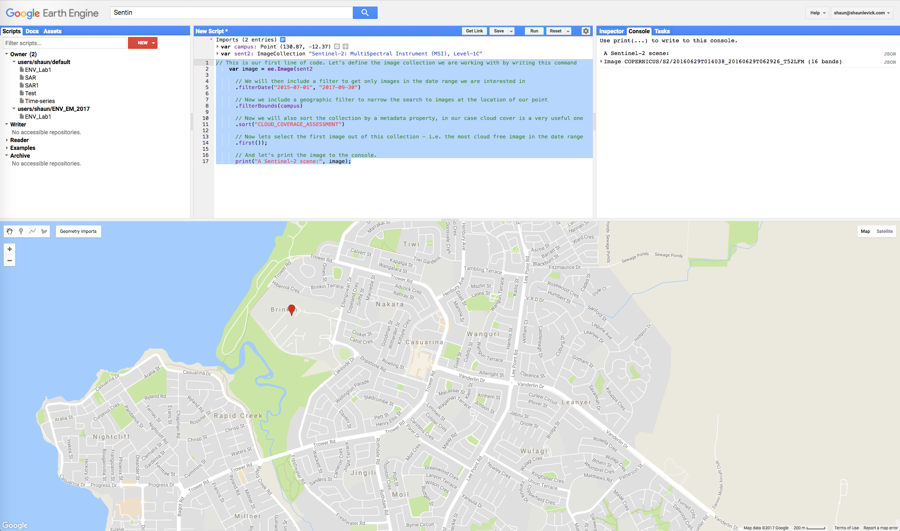
---------
## Adding images to the map view
Now in order to actually have a look at this image, we need to add it to our mapping environment. Before doing that however, lets define how we want to display the image. Let’s start with a true colour representation by pasting the following lines below the ones you’ve already added, and click "Run".

```javascript
// Define visualization parameters in a JavaScript dictionary for true colour rendering. Bands 4,3 and 2 needed for RGB.
    var trueColour = {
        bands: ["B4", "B3", "B2"],
        min: 0,
        max: 3000
        };

  // Add the image to the map, using the visualization parameters.
  Map.addLayer(image, trueColour, "true-colour image");
```

This code specifies that for a true colour image, bands 4,3 and 2 should be used in the RGB composite. After the image appears in the map, you can zoom in and explore Darwin.

We see great detail in the Sentinel-2 image, which is at 10m resolution for the selected bands. The (+) and (-) symbols in the upper left corner of the map can be used for zooming in and out (also possible with the mouse scroll wheel/trackpad). A left click with the mouse brings up the "hand" for panning to move around the image. Moving your mouse over the "Layers" button in the top right-hand corner of the map panel shows you the available layers, and lets you adjust the opacity of different layers.

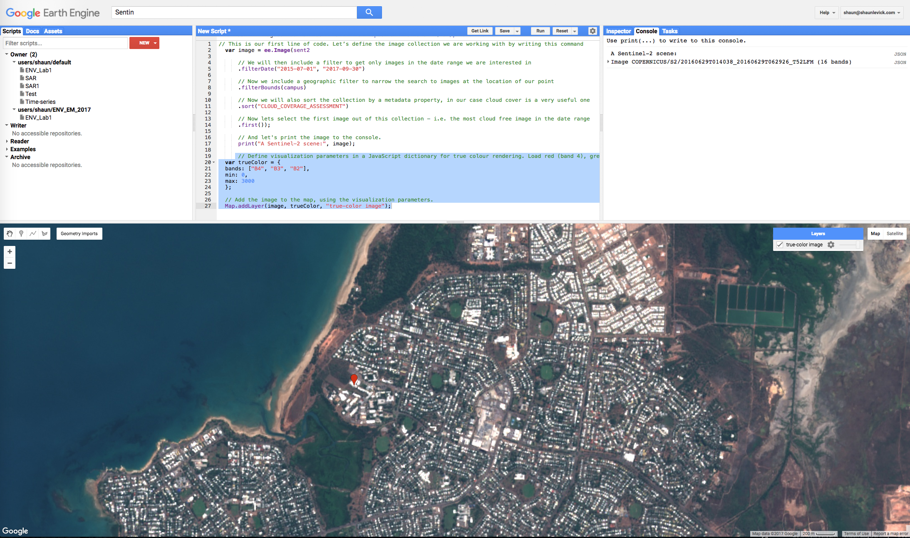

In order to find out more information at specific locations, we can use the Inspector tool which is located in the Console Panel - left hand tab. Click on the Inspector tab and then click on the image in the map view. Wherever you click on the image, the band values at that point will be displayed in the Inspector window. Click over some different patch types (sports fields, mangroves, ocean, beach, houses) to see how the spectral profile changes.


Now let's have a look at a false colour composite - we need to bring in the near-infrared band (band 8) for this. Paste the following lines below the ones you’ve already added, and click "Run".

```javascript
//Define false-colour visualization parameters.
    var falseColour = {
        bands: ["B8", "B4", "B3"],
        min: 0,
        max: 3000
        };

    // Add the image to the map, using the visualization parameters.
    Map.addLayer(image, falseColour, "false-color composite");
```

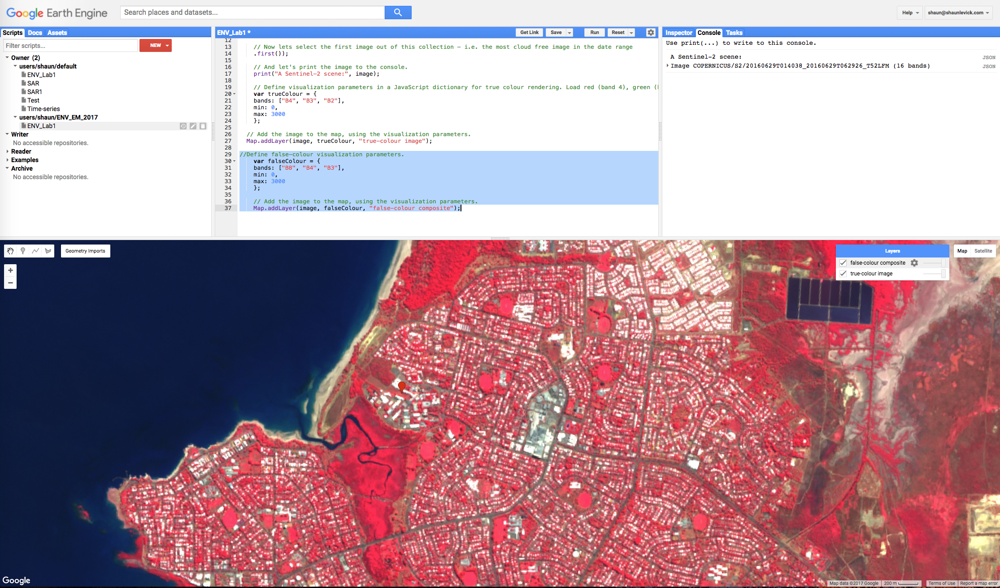

False-colour composites place the near infra-red band in the red channel, and we see a strong response to the chlorophyll content in green leaves. Vegetation that appears dark green in true colour, appearing bright red in the false-colour. Note the variations in red that can be seen in the vegetation bordering Rapid Creek. You will also see that "false-colour composite" has been added to the Layers tab in the map view.

---------

##Calculating NDVI

Finally, for last step in this lab, let's calculate the normalised-difference vegetation index (NDVI) for this image. NDVI is an index calculated from the RED and NIR bands, according to this equation:

NDVI = (NIR - RED)/(NIR + RED)

Paste the following lines below the ones you’ve already added, and click "Run".

```javascript
//Define variable NDVI from equation
    var NDVI = image.expression(
        "(NIR - RED) / (NIR + RED)",
        {
          RED: image.select("B4"),    //  RED
          NIR: image.select("B8"),    // NIR
          BLUE: image.select("B2")    // BLUE
        });

    Map.addLayer(NDVI, {min: 0, max: 1}, "NDVI");
```

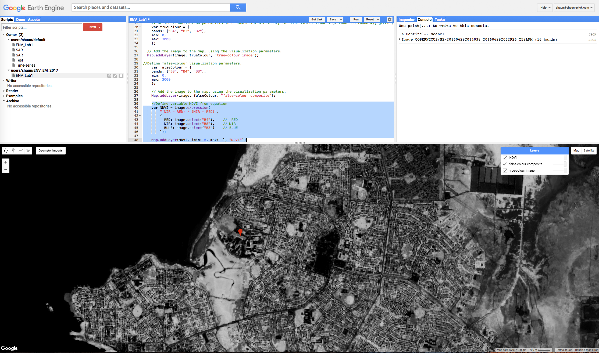

NDVI values range from 0 to 1, and the higher the value the more "vigorous" the vegetation.

----------

## Assessment task

Sentinel-2 is a relatively new platform, which will become increasingly important and prominent in ecosystem studies going forward. However for exploring historical trends in data, we need to turn to other platforms such as MODIS (since 2000) and Landsat (since the 1970s).

## Practical lab assignment 1 (30 marks)
1. Search for a cloud free Sentinel-2 and Landsat 8 image from 2016 collected over Litchfield National Park (Litchfield is located south of Darwin, near the town of Batchelor, Northern Territory, Australia).
2. Calculate NDVI for each of the scenes and load them into the map view.
3. Inspect how NDVI varies spatially across each image, and explore the patterns in NDVI vary according to the sensor used.
4. Write up a lab report with answers to the following questions:
    - what drives differences in NDVI values across the Litchfield area?
    - do NDVI values for the same vegetation patches vary between sensors?
    - if so, why do these difference between sensors arise?
    - what are the implications of between-sensor differences for long-term monitoring of vegetation condition?
 5. Include zoomed in maps (500 m scale bar) of the two NDVI images in your report to aid discussion.
 6. Include a copy of your Javascript code at the end of the report.
 7. Final lab reports are to be submitted as a single PDF document in Learnline.

*NB: Remember that i) the band position of RED and NIR wavelengths might differ between different sensors, and ii) pixel size may differ between different sensors; and iii) time of year is an important consideration. For Landsat 8, the metadata property for cloud cover is 'CLOUD_COVER'.*

----------

GEARS - Geospatial Ecology and Remote Sensing lab - https://www.geospatialecology.com
